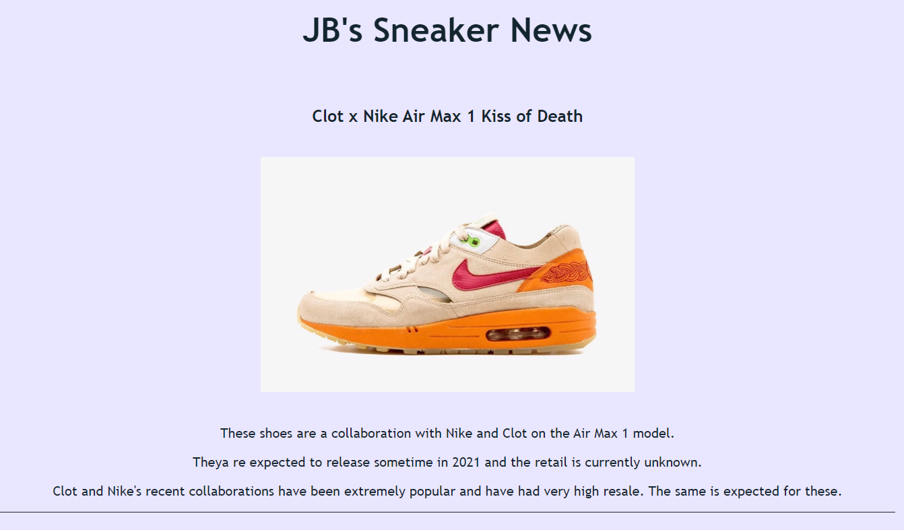

# JB's Shoe News

(This was created during our time as students at Code Chrysalis.)

This app will keep you up to date with all hyped sneaker releases coming up in the future and keep you informed on past releases and what their resale prices look like.

Check out the latest sneaker news at:
[JB's Shoe News](https://jbs-shoe-news.web.app/)

### Preview of the website:




## Installation

1. Feel free to clone the repo

2. Install packages

```bash
npm install
```

3.  Install create-elm-app (optional)
```bash
npm install create-elm-app -g
```

4. Open in localhost
```bash
elm-app start
```


## Built With

- [Elm](https://elm-lang.org/docs)
- [Firebase](https://firebase.google.com/)

## Contributing

Feel free to make some pull requests if you want to make some changes or add features.

## Future Plans 

- Add a page giving tips on how to purchase hyped shoes
- Instead of listing all the information right away, adding a clickable list to get more info on the shoes you are interested in
- Add a date written/updated and have it sorted by that
- Implement a max amount of how many sneakers can be shown on one page


## License

[MIT](https://choosealicense.com/licenses/mit/)

## Authors

- [Jeff Bentley](https://github.com/jbentleyjp)
